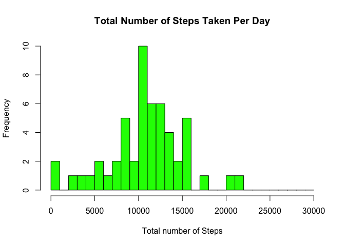
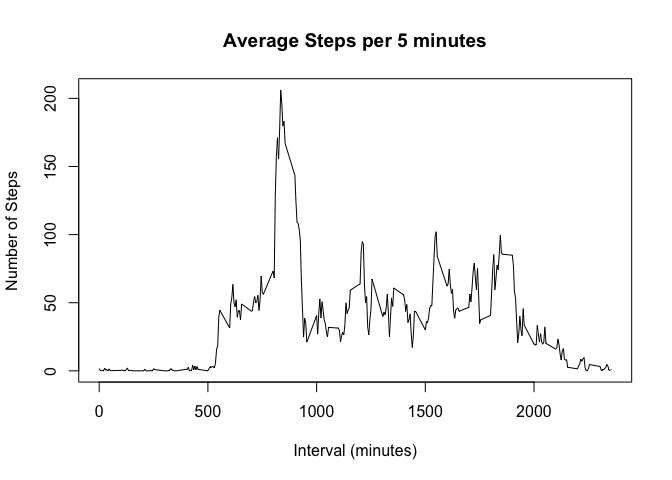
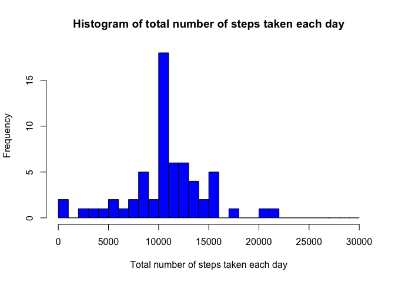
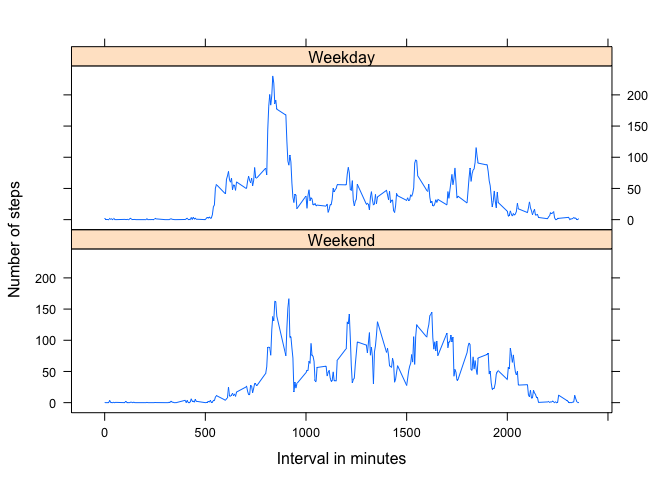

# Reproducible Research: Peer Assessment 1


## Loading and preprocessing the data
##If assignment data doesn't exist, extract the assignment data to the working directory and load it into R :
  

```r
if(!file.exists("activity.csv"))
{
  unzip(zipfile = "activity.zip", overwrite = TRUE)
}
activity <- read.csv("activity.csv", header = T)
```

Sample Data:

```r
str(activity)
```

```
## 'data.frame':	17568 obs. of  3 variables:
##  $ steps   : int  NA NA NA NA NA NA NA NA NA NA ...
##  $ date    : Factor w/ 61 levels "2012-10-01","2012-10-02",..: 1 1 1 1 1 1 1 1 1 1 ...
##  $ interval: int  0 5 10 15 20 25 30 35 40 45 ...
```

```r
names(activity)
```

```
## [1] "steps"    "date"     "interval"
```

Add the column to classify for day type (weekday or weekend)

```r
activity$recordDate<-strptime(activity$date, format="%Y-%m-%d")
activity$classifiedDay<-factor(weekdays(activity$recordDate) %in% c("Saturday", "Sunday"), labels = c("Weekend", "Weekday"), levels=c(TRUE, FALSE)) 
```


## What is mean total number of steps taken per day?
##The histogram generated form code below shows the total steps taken per day.


```r
totalStepsPerDate<-aggregate(steps~date,data=activity,FUN=sum)
totalStepsPerDate$date<-strptime(totalStepsPerDate$date,format="%Y-%m-%d")

hist(as.integer(totalStepsPerDate$steps), 
     breaks = seq(from=0, to=30000, by=1000),
     col = "green",
     xlab = "Total number of Steps",
     main = "Total Number of Steps Taken Per Day")
```



#### Calculate mean and median

Calculating Mean

```r
meanStepsTakenPerDay <- mean(totalStepsPerDate$steps,na.rm=TRUE)
meanStepsTakenPerDay
```

```
## [1] 10766.19
```

Calculating Median

```r
medianStepsTakenPerDay <- median(totalStepsPerDate$steps,na.rm=TRUE)
medianStepsTakenPerDay
```

```
## [1] 10765
```

```r
## What is the average daily activity pattern?
##The time-series plot with 5 minutes interval on the x-axis and number of steps taken on the y-axis illustrates the average daily activity pattern.
```

```r
aggregateStepsPerInterval<-aggregate(steps~interval,data=activity,FUN=mean)

plot(x = aggregateStepsPerInterval$interval,
     y=aggregateStepsPerInterval$steps,
     type = "l",
     xlab = "Interval (minutes)",
     ylab = "Number of Steps",
     main = "Average Steps per 5 minutes")
```



Interval having Maximum Average Steps

The maximum average steps on interval is:
  
  ```r
  intervalWithMaximumAggSteps <- aggregateStepsPerInterval[which.max(aggregateStepsPerInterval$steps),"interval"]
  intervalWithMaximumAggSteps
  ```
  
  ```
  ## [1] 835
  ```

## Imputing missing values
##Total number of rows

```r
nrow(activity)
```

```
## [1] 17568
```
Total number of missing values

```r
sum(is.na(activity$steps))
```

```
## [1] 2304
```
Agerage steps of interval is used to fill up the NA step columns.


```r
naRemovedActivityData<-merge(activity,aggregateStepsPerInterval,by.x="interval",by.y="interval",all = TRUE)
for(i in 1:nrow(naRemovedActivityData))
{
  if(is.na(naRemovedActivityData[i,"steps.x"]))
  {
    naRemovedActivityData[i,"steps.x"]<-round(naRemovedActivityData[i,"steps.y"],0)
  }
  
}
colnames(naRemovedActivityData)[which(names(naRemovedActivityData) == "steps.x")] <- "steps"
```
Calculating the total number of steps taken each day:
  

```r
aggNaRemovedActivityData<-aggregate(steps~date, data=naRemovedActivityData, FUN=sum)

aggNaRemovedActivityData$date<-strptime(aggNaRemovedActivityData$date, format="%Y-%m-%d")

hist(as.integer(aggNaRemovedActivityData$steps),
     breaks=seq(from=0, to=30000, by=1000),
     col = "blue",
     xlab = "Total number of steps taken each day",
     main = "Histogram of total number of steps taken each day")
```


Calculating Mean

```r
mean(aggNaRemovedActivityData$steps,na.rm=TRUE)
```

```
## [1] 10765.64
```

Calculating Median

```r
median(aggNaRemovedActivityData$steps,na.rm=TRUE)
```

```
## [1] 10762
```

## Are there differences in activity patterns between weekdays and weekends?

```r
library(lattice)
aggWeekend<-aggregate(steps~interval+classifiedDay, data=naRemovedActivityData, FUN=mean)
xyplot(steps~interval|classifiedDay,
       data=aggWeekend,
       layout=c(1,2),
       type="l",
       xlab = "Interval in minutes",
       ylab = "Number of steps")
```




##From the above plot we can see the difference in the activity patterns in weekdays and weekends.
